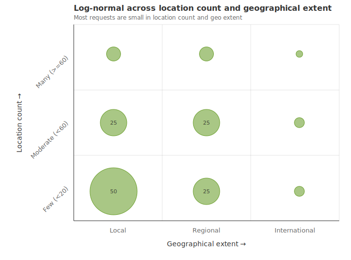
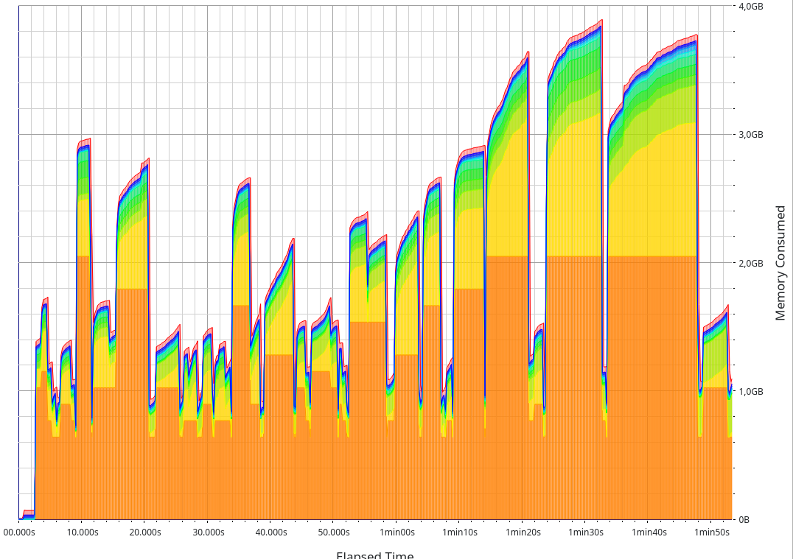

# Benchmarking Valhalla's CostMatrix

In valhalla/#5978, the effectiveness of CostMatrix' reservation config parameters came up, so I have decided to dig a little deeper and see how well they work in reality. 
 

## Usual traffic patterns

"Reality" is a bit of an opaque concept in this context, because it can mean different things based on how you (or your users) are utilizing the service. For sake of simplicity, let's reduce the overall shape of a matrix request to two dimensions: 

  1. its number of locations (again for simplicity, let's assume they are symmetrical)
  2. its geographical extent

> Note that geographical extent here really is a proxy for the size of each expansion which in turn not only depends on how geographically dispersed a request's locations are, but also on the costing, hierarchy limits, road density, etc etc). But, again, let's keep it simple.

I assume that for most Valhalla instances, the usual traffic pattern, when reduced to these two dimensions, looks a bit like this: 



Where most requests are "small" in either dimension and very rarely ever "big" in both.

## Gather test data

Based on this assumption, I create a way to build a set of test requests that'll help me simulate the described pattern. I make Claude write me a Python script that takes 
  - a place name 
  - the desired number of locations 
  - a data set with points to choose from
  - and some Valhalla request JSON to mix in with the request JSON  

The script will then 

  - query Nominatim for a polygon using the place name 
  - find all points from our point data set that are inside that polygon 
  - randomly pick n points and make a request with n sources and n targets

I use a predefined point data set because otherwise the points will land in odd places, like somewhere far away from roads, or in topological islands like major airports. The data set I choose is every single bus stop in Europe from OSM: 


```bash 
wget https://download.geofabrik.de/europe-latest.osm.pbf -O eu.pbf
osmium tags-filter eu.pbf n/highway=bus_stop -o bus_stops.osm 
ogr2ogr -f CSV bus_stops.csv bus_stops.osm points -lco GEOMETRY=AS_XY -select "" 
```

Bus stops are nice because 

  - they are close to roads
  - they somewhat correlate with population density


Going back to the graphic above, we now have 9 cells in our 2-dimensional grid. So I create a directory for each cell with the pattern `<y>_<x>` or `<location_dimension>_<geographical_extent_dimension`, so `0_1` means few locations and local geographical dispersion, and so on. Then I populate each cell directory with requests using a bash script with some hard coded inputs into our Python script (see [the bash script](./gen_requests)): 

```bash 
jobs=(
    # 0_0: <20 locs, city-scale
    "'Ingolstadt, Germany' 5 ingolstadt 0_0" 
    "'Köln, Germany' 10 koeln 0_0"
    "'Bruges, Belgium' 5 bruges 0_0"
    "'Tallinn, Estonia' 8 tallinn 0_0"
# ... and so on; I had Claude come up with ~200 of these

# location count mapping:
# <20 locs = 0
# <60 locs = 1
# >=60 locs = 2
# geo:
# city/small region = 0
# region/small country = 1
# country = 2

```

Finally, our populated request set looks like this: 

``` 

matrix_requests
├── 0_0
│   ├── andorra_la_vella_5.geojson
│   ├── andorra_la_vella_5.json
│   ├── basel_6.geojson
│   ├── basel_6.json
│   ├── bergen_7.geojson
│   ├── bergen_7.json
...
├── 0_1
│   ├── aland_4.json
│   ├── balearic_10.geojson
...
├── 0_2
│   ├── austria_18.json
│   ├── portugal_18.json
│   ├── slovakia_15.geojson
│   ├── switzerland_country_18.geojson
│   └── switzerland_country_18.json
...
├── 1_0
│   ├── warsaw_40.geojson
│   ├── warsaw_40.json
│   ├── wien_40.geojson
│   ├── wien_40.json
│   ├── zagreb_25.geojson
│   ├── zagreb_25.json
...
├── 1_1
│   ├── andalusia_45.geojson
│   ├── andalusia_45.json
│   ├── baden_wuerttemberg_45.geojson
│   ├── baden_wuerttemberg_45.json
│   ├── nouvelle_aquitaine_40.geojson
│   ├── nouvelle_aquitaine_40.json
│   ├── wales_25.geojson
│   ├── wales_25.json
│   ├── wallonia_25.geojson
│   └── wallonia_25.json
...
├── 1_2
│   ├── finland_35.geojson
│   ├── finland_35.json
│   ├── greece_40.geojson
│   ├── greece_40.json
│   ├── norway_40.geojson
...
├── 2_0
│   ├── barcelona_large_65.geojson
│   ├── barcelona_large_65.json
│   ├── berlin_large_70.geojson
│   ├── berlin_large_70.json
...
├── 2_1
│   ├── andalusia_large_75.geojson
│   ├── andalusia_large_75.json
│   ├── baden_wuerttemberg_large_75.geojson
│   ├── baden_wuerttemberg_large_75.json
...
├── 2_2
│   ├── finland_large_60.geojson
│   ├── finland_large_60.json
│   ├── france_100.geojson
│   ├── france_100.json
...

10 directories, 361 files
```

## Running the simulation

I made Claude come up with another Python script for this that when pointed to this directory hierarchy, it will pick a seeded choice of n requests that follow a distribution defined in a separate JSON file. For our log normal distribution this looks like this: 

```json 
{
  "name": "lognormal",
  "weights": {
    "0_0": 40,
    "0_1": 15,
    "0_2": 5,
    "1_0": 20,
    "1_1": 8,
    "1_2": 3,
    "2_0": 5,
    "2_1": 3,
    "2_2": 1
  }
}
```

Then we can point it at a Valhalla server and run it like this: 

```bash 
python valhalla_weighted_load.py matrix_requests bucket_configs/lognormal.json -t 1 | tee logs/master_no_reservations.log
```


## Results 

### Master 

#### No reservation

``` 
============================================================
config:       lognormal
wall time:    109.73s
requests:     100 (0 errors)
latency min:  0.008s
latency p50:  0.264s
latency p95:  5.098s
latency max:  15.069s
throughput:   0.91 req/s

per-bucket breakdown:
  bucket    count errors      p50      p95      max
  -------- ------ ------ -------- -------- --------
  0_0          43      0   0.067s   0.261s   0.367s
  0_1           8      0   0.165s   0.342s   0.342s
  0_2           3      0   0.609s   0.674s   0.674s
  1_0          24      0   0.823s   1.500s   2.324s
  1_1           9      0   1.073s   3.703s   3.703s
  1_2           3      0   3.559s   4.353s   4.353s
  2_0           6      0   2.985s  10.064s  10.064s
  2_1           3      0   5.098s   7.280s   7.280s
  2_2           1      0  15.069s  15.069s  15.069s
============================================================
``` 

(for full log see [here](./logs/master_lognormal_0_locs_0_labels.log))

#### max_reserved_locations = 25, max_labels = 200'000

```
============================================================
config:       lognormal
wall time:    130.66s
requests:     100 (0 errors)
latency min:  0.009s
latency p50:  0.265s
latency p95:  6.612s
latency max:  20.628s
throughput:   0.77 req/s

per-bucket breakdown:
  bucket    count errors      p50      p95      max
  -------- ------ ------ -------- -------- --------
  0_0          43      0   0.071s   0.241s   0.349s
  0_1           8      0   0.166s   0.339s   0.339s
  0_2           3      0   0.566s   0.674s   0.674s
  1_0          24      0   0.818s   1.628s   2.440s
  1_1           9      0   1.143s   4.594s   4.594s
  1_2           3      0   3.999s   5.034s   5.034s
  2_0           6      0   3.933s  11.824s  11.824s
  2_1           3      0   6.612s  10.219s  10.219s
  2_2           1      0  20.628s  20.628s  20.628s
============================================================
```

(for full log see [here](./logs/master_lognormal_25_locs_2e5_labels.log))

#### Mhh that doesn't look right...

So it looks like on the few "large" requests Valhalla chokes on larger reservations. When sampling both runs with `samply`, I notice that with the reservations, a lot of extra time is spent in `CostMatrix::GetAstarHeuristics(...)`, specifically in `std::_Rb_tree_cons_iterator::operator++`. It looks like it's spending an unusual amount of time iterating through `LocationStatus::unfound_connections` which is a `std::set`, which uses a binary tree under the hood where each node is allocated separately. 

My theory is that with these repeated big memory allocations from the reservations, memory is fragmented and these nodes are located very far from each other. The simplest fix is to use `ankerl::unordered_dense::set`, which we already use elsewhere and which uses flat containers. There are other things we could do here like just using a vector, but let's keep it simple; these sets will be small anyway.


### Using `ankerl::unordered_dense::set` for `LocationStatus::unfound_connections`

#### No reservations

``` 
============================================================
config:       lognormal
wall time:    94.01s
requests:     100 (0 errors)
latency min:  0.009s
latency p50:  0.251s
latency p95:  4.287s
latency max:  11.902s
throughput:   1.06 req/s

per-bucket breakdown:
  bucket    count errors      p50      p95      max
  -------- ------ ------ -------- -------- --------
  0_0          43      0   0.065s   0.251s   0.364s
  0_1           8      0   0.158s   0.325s   0.325s
  0_2           3      0   0.574s   0.624s   0.624s
  1_0          24      0   0.755s   1.381s   2.140s
  1_1           9      0   0.986s   3.200s   3.200s
  1_2           3      0   3.135s   3.698s   3.698s
  2_0           6      0   2.519s   7.861s   7.861s
  2_1           3      0   4.377s   5.600s   5.600s
  2_2           1      0  11.902s  11.902s  11.902s
============================================================
```
(for full log see [here](./logs/set_lognormal_0_locs_0_labels.log))

#### max_reserved_locations = 25, max_labels = 200'000

``` 
============================================================
config:       lognormal
wall time:    95.29s
requests:     100 (0 errors)
latency min:  0.009s
latency p50:  0.256s
latency p95:  4.329s
latency max:  12.068s
throughput:   1.05 req/s

per-bucket breakdown:
  bucket    count errors      p50      p95      max
  -------- ------ ------ -------- -------- --------
  0_0          43      0   0.070s   0.236s   0.340s
  0_1           8      0   0.167s   0.336s   0.336s
  0_2           3      0   0.553s   0.626s   0.626s
  1_0          24      0   0.743s   1.384s   2.119s
  1_1           9      0   0.999s   3.250s   3.250s
  1_2           3      0   3.200s   3.769s   3.769s
  2_0           6      0   2.613s   7.953s   7.953s
  2_1           3      0   4.337s   5.630s   5.630s
  2_2           1      0  12.068s  12.068s  12.068s
============================================================
```

(for full log see [here](./logs/set_lognormal_25_locs_2e5_labels.log))


#### Better, but... 

This improves the performance quite a lot, but still the no reservation run is faster than the one using reservations. I notice another thing, which is that we always resize the outer edge label vectors according to the number of locations, so when a request with lots of locations is preceded by one with few, we deallocate a lot of inner vectors just before we need them again. 

Let's keep the outer vectors always allocated according to the max_reserved_locations parameter and try again.

### Keeping outer edge label vectors allocated


#### No reservations

``` 
============================================================
config:       lognormal
wall time:    94.11s
requests:     100 (0 errors)
latency min:  0.008s
latency p50:  0.251s
latency p95:  4.275s
latency max:  11.915s
throughput:   1.06 req/s

per-bucket breakdown:
  bucket    count errors      p50      p95      max
  -------- ------ ------ -------- -------- --------
  0_0          43      0   0.067s   0.251s   0.364s
  0_1           8      0   0.161s   0.333s   0.333s
  0_2           3      0   0.589s   0.656s   0.656s
  1_0          24      0   0.765s   1.378s   2.099s
  1_1           9      0   0.990s   3.201s   3.201s
  1_2           3      0   3.138s   3.701s   3.701s
  2_0           6      0   2.519s   7.856s   7.856s
  2_1           3      0   4.293s   5.576s   5.576s
  2_2           1      0  11.915s  11.915s  11.915s
============================================================
```
(for full log see [here](./logs/set_labelvec_lognormal_0_locs_0_labels.log))

#### max_reserved_locations = 25, max_labels = 200'000

``` 
============================================================
config:       lognormal
wall time:    92.69s
requests:     100 (0 errors)
latency min:  0.009s
latency p50:  0.246s
latency p95:  4.100s
latency max:  11.788s
throughput:   1.08 req/s

per-bucket breakdown:
  bucket    count errors      p50      p95      max
  -------- ------ ------ -------- -------- --------
  0_0          43      0   0.072s   0.230s   0.339s
  0_1           8      0   0.160s   0.320s   0.320s
  0_2           3      0   0.538s   0.616s   0.616s
  1_0          24      0   0.720s   1.361s   2.076s
  1_1           9      0   0.969s   3.142s   3.142s
  1_2           3      0   3.093s   3.701s   3.701s
  2_0           6      0   2.544s   7.729s   7.729s
  2_1           3      0   4.100s   5.502s   5.502s
  2_2           1      0  11.788s  11.788s  11.788s
============================================================
```

(for full log see [here](./logs/set_labelvec_lognormal_25_locs_2e5_labels.log))

#### max_reserved_locations = 100, max_labels = 2'000'000

``` 
============================================================
config:       lognormal
wall time:    92.65s
requests:     100 (0 errors)
latency min:  0.008s
latency p50:  0.251s
latency p95:  4.114s
latency max:  11.823s
throughput:   1.08 req/s

per-bucket breakdown:
  bucket    count errors      p50      p95      max
  -------- ------ ------ -------- -------- --------
  0_0          43      0   0.072s   0.229s   0.344s
  0_1           8      0   0.158s   0.324s   0.324s
  0_2           3      0   0.531s   0.621s   0.621s
  1_0          24      0   0.716s   1.355s   2.087s
  1_1           9      0   0.967s   3.156s   3.156s
  1_2           3      0   3.152s   3.705s   3.705s
  2_0           6      0   2.529s   7.686s   7.686s
  2_1           3      0   4.114s   5.458s   5.458s
  2_2           1      0  11.823s  11.823s  11.823s
============================================================
```
(for full log see [here](./logs/set_labelvec_lognormal_100_locs_2e6_labels.log))


#### Finally! 

The reservations work properly, and I found their saturation point (more or less).

Now what about the memory growth in #5978 though? Can we now also reset the reached maps without paying for the extra allocations? 


### Reset ReachedMap and reserve conservatively (max_reserved_locations = 100, max_labels = 2'000'000)  

``` 
============================================================
config:       lognormal
wall time:    92.86s
requests:     100 (0 errors)
latency min:  0.008s
latency p50:  0.246s
latency p95:  4.129s
latency max:  11.804s
throughput:   1.08 req/s

per-bucket breakdown:
  bucket    count errors      p50      p95      max
  -------- ------ ------ -------- -------- --------
  0_0          43      0   0.071s   0.228s   0.340s
  0_1           8      0   0.160s   0.323s   0.323s
  0_2           3      0   0.536s   0.612s   0.612s
  1_0          24      0   0.726s   1.365s   2.061s
  1_1           9      0   0.984s   3.158s   3.158s
  1_2           3      0   3.086s   3.729s   3.729s
  2_0           6      0   2.530s   7.749s   7.749s
  2_1           3      0   4.129s   5.519s   5.519s
  2_2           1      0  11.804s  11.804s  11.804s
============================================================
```

(for full log see [here](./logs/set_labelvec_reachedmapswap_if_lognormal_25_locs_2e5_labels_1e8_reached_map.log))

#### Good enough maybe? 

This gets _very_ close (within <1%) of the previous best run that didn't ever deallocate ReachedMap's internal memory. I think the benefit (way less RAM consumption) far outweighs the cost (almost no performance penalty), so I'd advocate for finding a heuristic for finding appropriate numbers to pass to `ankerl::unordered_dense::set<>::reserve(...)`, based on the request shape.


### One more thing: monotonic buffers 

Finally, I wanted to experiment with an entirely different approach: what if instead of using the default allocator, we use a monotonic buffer for (almost) all dynamically allocated objects in CostMatrix? The user wouldn't have to play around with multiple config parameters: there would be a single `costmatrix.memory_buffer_size_mb` parameter that controls the buffer size per worker/costmatrix instance. Since it uses monotonic allocation and a pre-allocated buffer, it will likely be faster than what we have so far, and it might yield better cache friendliness. 

The downside is that peak memory usage will be higher, because monotonic growth means once an object needs to be reallocated because it gets to large, its previously allocated memory will not be released until all the work is done.

#### No pre-allocated buffer

``` 
============================================================
config:       lognormal
wall time:    88.97s
requests:     100 (0 errors)
latency min:  0.007s
latency p50:  0.237s
latency p95:  3.978s
latency max:  11.758s
throughput:   1.12 req/s

per-bucket breakdown:
  bucket    count errors      p50      p95      max
  -------- ------ ------ -------- -------- --------
  0_0          43      0   0.068s   0.237s   0.311s
  0_1           8      0   0.136s   0.293s   0.293s
  0_2           3      0   0.534s   0.585s   0.585s
  1_0          24      0   0.726s   1.285s   1.947s
  1_1           9      0   0.928s   2.945s   2.945s
  1_2           3      0   3.067s   3.534s   3.534s
  2_0           6      0   2.341s   7.669s   7.669s
  2_1           3      0   4.164s   5.280s   5.280s
  2_2           1      0  11.758s  11.758s  11.758s
============================================================
```
(for full log see [here](./logs/monotonic_0.log))

#### 2GB pre-allocated buffer

``` 
============================================================
config:       lognormal
wall time:    81.22s
requests:     100 (0 errors)
latency min:  0.007s
latency p50:  0.208s
latency p95:  3.685s
latency max:  11.059s
throughput:   1.23 req/s

per-bucket breakdown:
  bucket    count errors      p50      p95      max
  -------- ------ ------ -------- -------- --------
  0_0          43      0   0.049s   0.192s   0.245s
  0_1           8      0   0.126s   0.269s   0.269s
  0_2           3      0   0.468s   0.536s   0.536s
  1_0          24      0   0.610s   1.182s   1.798s
  1_1           9      0   0.855s   2.767s   2.767s
  1_2           3      0   2.757s   3.244s   3.244s
  2_0           6      0   2.170s   6.984s   6.984s
  2_1           3      0   3.685s   4.816s   4.816s
  2_2           1      0  11.059s  11.059s  11.059s
============================================================
```
(for full log see [here](./logs/monotonic_2000.log))

#### Great, but what about peak memory?

Let's compare our new base line (using unordered set, keeping outer edge label vectors allocated and reset ReachedMap's) to the monotonic buffer approach.





The difference couldn't be more obvious; most of the time, the memory usage of the monotonic buffer approach is comparable to our base line, albeit more stable since we always keep our 2GB buffer around. Unfortunately that one "big" request really busts the bank, peaking at twice the memory consumption as the base line.

I wonder how much of this is due to there being no reservations at all, causing all the vectors to be constantly reallocated. Maybe a smart reservation strategy based on the request shape could prevent peaks like this. But that's for another day...
